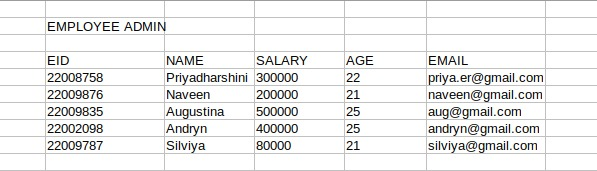
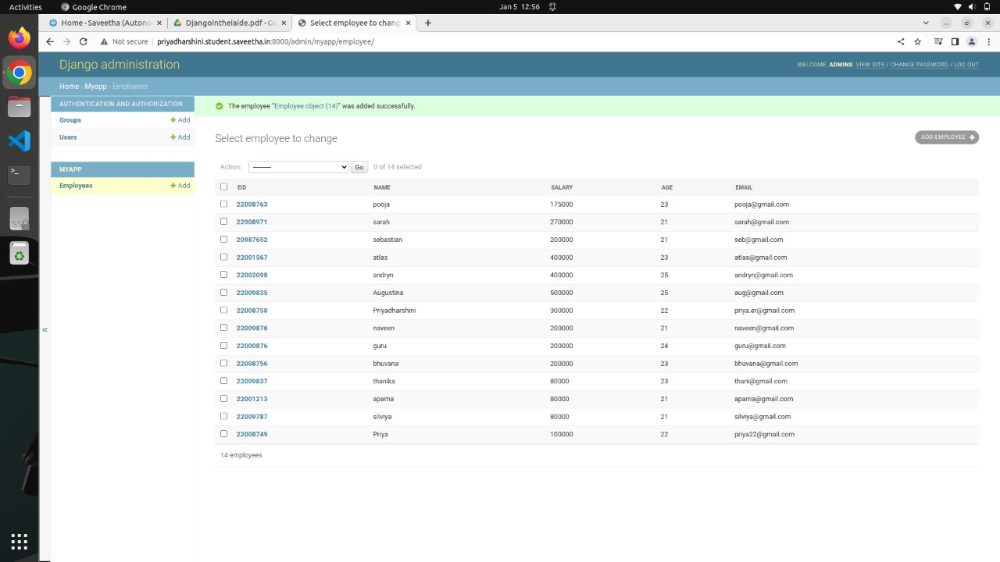

# Django ORM Web Application

## AIM
To develop a Django application to store and retrieve data from a database using Object Relational Mapping(ORM).

## Entity Relationship Diagram

## DESIGN STEPS

### STEP 1:
Clone the repository to theia ide and Start a new app inside the project folder

### STEP 2:
Type the appropriate code for your table and provide appropriate data types to the columns

### STEP 3:
Create a report about your project in readme.md file and upload the django.orm.app folder to your remote repository

## PROGRAM

from django.db import models

from django.contrib import admin

class Employee(models.Model):

    eid=models.Charfield(max_length=20,help_text="Employee ID")
    name=models.Charfield(max_length=100)
    salary=models.IntegerField()
    age=models.IntegerField()
    email=models.EmailField()
class EmployeeAdmin(admin.ModelAdmin):

    list_display=('eid','name','salary','age','email')
    
## OUTPUT

## RESULT

Hence we developed a Django application to store and retrieve data from a database using Object Relational Mapping (ORM)
